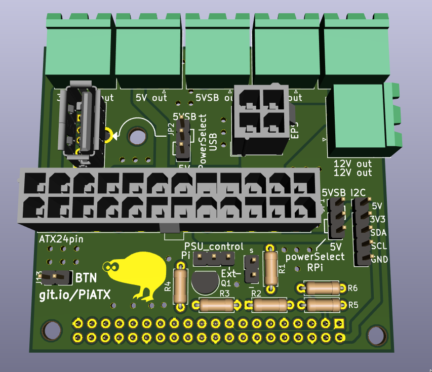
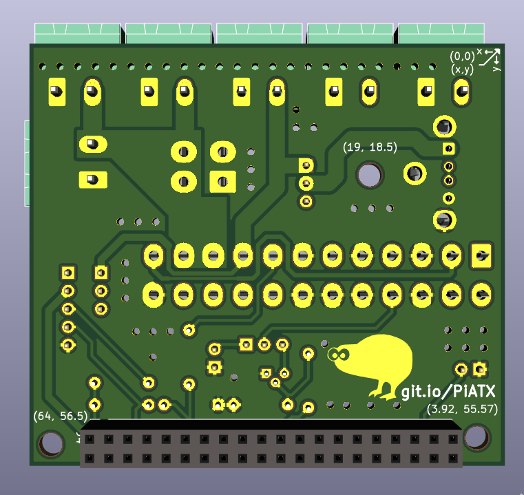

# Pi ATX power breakout

This is just a simple board that breaks out the different rails of an ATX 24pin connector. It's mainly intented to be used for powering a Raspberry Pi and a 3D printer.

The board includes an EPS 4pin connector as well, allowing for up to 32A on the 12v rail. If you slightly overrun the rated 8A per cable, the 3 12v connectors will handle up to 36A (12A each). This is a 12.5% overload at 9A per cable. Most good cables/connectors should handle that.

The other rails can output 12A max, if the PSU can supply that on that rail.

The board also has a header for selecting how to control the PS_ON signal. It can either be controlled via a transistor controled by the RPi. Aditionally, the "Power Good" signal is also connected to the pi (through a voltage dividier).
Lastly, the I2C interface of the Pi is exposed on a 5 pin header, along with 5V 3V3 and Ground.

The 5V supply for the I2C connector and the Pi is selected through the the jumper JP1, while the 5V supply for the USB connector is selected via JP2. You can select between the 5V rail, or the 5V standby rail.

| Pin   | Function   |
|-------|------------|
| BCM17 | Power Good |
| BCM9  | Power On   |
| BCM26 | BTN to GND |

